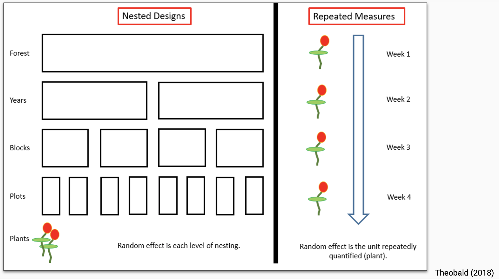

# Setup

## Packages
```{r setup, include=FALSE}
knitr::opts_chunk$set(echo = TRUE)
# These are the two *easiest* R packages for mixed effects modeling that I am aware of:
#install.packages('lme4')
library(lme4) # I picked out this one to use in more depth, but not for any specific reasons that I remember
#install.packages('nlme')
library(nlme)
# Other packages for running mixed effects models with more complex model structures and that have more of a focus on Bayesian statistics than lme4 or nlme are rjags, INLA and rstan; however, I have no experience using these

# Other useful packages that we were using:
# For model results tables:
#devtools::install_github("strengejacke/strengejacke")
library(strengejacke)
library(sjPlot) # tab_model for MEM or linear regression results tables
# For multicolinearity assumptions:
library(performance)
# 'Remef' -- will describe in more depth at the end
#devtools::install_github("hohenstein/remef")
library(remef)

library(tidyverse)
```

## Dataset
```{r}
data <- read.csv('flam.data.csv')
```

**Predictors**:
lfm: Live fuel moisture (%)
mpa: Water potential (MPa)
dw.flam.sample: Dry weight of the sample loaded onto the epiradiator (calculated using sample.wt and lfm)

**Dependent Variables** (of interest):
tti: time to ignition (seconds)
fh: flame height (cm)
fd: flame duration (seconds)
temp.max: maximum temperature (degrees C)

**Covariates**:
spp: CEME = *Ceanothus megacarpus* (Bigpod Ceanothus) and ADFA = *Adenostoma fasciculatum* (Chamise)
sample.wt
site
year.month
start.temp

# Ex. 1: Predicting TTI
Only looking at instances that the sample ignited
```{r}
data.ignited <- data %>% 
  filter(ignition == 1)
```

## Linear Modeling
Prior to diving into MEM, linear models to compare with the mixed effects models:
```{r}
lm.lfm.1 <- lm(tti ~ lfm + sample.wt + start.temp + year.month + spp, data = data.ignited)

lm.mpa.1 <- lm(tti ~ mpa + sample.wt + start.temp + year.month + spp, data = data.ignited)

lm.both.1 <- lm(tti ~ lfm + mpa + sample.wt + start.temp + year.month + spp, data = data.ignited)
```

```{r}
tab_model(lm.lfm.1, lm.mpa.1, lm.both.1, # tab_model() is function from sjPlot package
          show.reflvl = TRUE, # show reference level
          digits = 3, # number of digits to round to
          show.aic = TRUE, # show AIC?
          show.ci = FALSE, # show confidence interval?
          show.r2 = TRUE, # show R^2 values
          pred.labels = c('Intercept', 'Water Potential', 'LFM', 'Sample Wt.', 'Species (CEME)', 'Starting Temp.',
          'Year, Month (2018, January)', 'Year, Month (2019, December)', 'Year, Month (2020, January)', 
          'Year, Month (2020, September)'),# Labeling predictors
          dv.labels = c("LFM", "Water Potential", "LFM and Water Potential"), # Labeling models
          title = "Ex. 1: Predicting TTI, Linear Models", # Title
          string.p = "P-Value", # Column heading for p-value column
          p.style = "stars") # P-values represented by asterisks
```

## Linear Mixed Effects Modeling
```{r}
lme.lfm.1 <- lmer(tti ~ lfm + sample.wt + start.temp + year.month + spp + (1 | individual), data = data.ignited)

lme.mpa.1 <- lmer(tti ~ mpa + sample.wt + start.temp + year.month + spp + (1 | individual), data = data.ignited)

lme.both.1 <- lmer(tti ~ mpa + lfm + sample.wt + start.temp + year.month + spp + (1 | individual), data = data.ignited)
```

```{r}
tab_model(lm.lfm.1, lm.mpa.1, lm.both.1, lme.lfm.1, lme.mpa.1, lme.both.1,
          show.reflvl = TRUE, # show reference level
          digits = 3, # number of digits to round to
          show.aic = TRUE, # show AIC?
          show.ci = FALSE, # show confidence interval?
          show.r2 = TRUE, # show R^2 values
          pred.labels = c('Intercept', 'Water Potential', 'LFM', 'Sample Wt.', 'Species (CEME)', 'Starting Temp.',
          'Year, Month (2018, January)', 'Year, Month (2019, December)', 'Year, Month (2020, January)', 
          'Year, Month (2020, September)'),# Labeling predictors
          dv.labels = c("LFM (linear)", "MPa (linear)", "LFM and MPa (linear)", "LFM (MEM)", "MPa (MEM)",
                        "LFM and MPa (MEM)"), # Labeling models
          title = "Ex. 1: Predicting TTI, Linear Models AND Mixed Effects Models", # Title
          string.p = "P-Value", # Column heading for p-value column
          p.style = "stars") # P-values represented by asterisks
```

# Mixed Effects Models Background
## Why use mixed effects models?

Mixed effects models incorporate fixed and random effects into the model. This is especially useful for nested, clustered or repeated data. Without accounting for random effects, issues of pseudoreplication can occur.

```{r}

```

Other benefits:
- Good for unbalanced sampling designs -- makes meeting assumptions easier
- Easier to specify than complex ANOVA designs

## Random vs. fixed effects
```{r}

```

I have also heard that categorical variables with less than a certain amount of levels should not be included as random effects, but looking online, it seems like this varies a good amount based on who you ask. Since our species and year.month variables have a limited amount of levels AND we had research questions that depended on comparing the means between these levels, we included them as fixed effects

## Random intercepts vs. slopes
```{r}

```

Typically, you would use random intercepts or random intercepts & slopes. Unless there is good evidence for significant differences in slopes between groups, it is usually the safest (and easiest to interpret) option to use random intercepts.

## Assumptions
- Normality of residuals
- Homogeneity of variance

# Ex. 2: More in-depth mixed effects model selection

Below resembles our linear MEM selection process, predicting flame height

## Scaling all continuous variables (LFM, water potential, dry weight, sample.wt, and start.temp)
```{r}
data.ignited <- data.ignited %>% 
  mutate(lfm.scaled = scale(lfm)) %>% 
  mutate(mpa.scaled = scale(mpa)) %>% 
  mutate(dw.scaled = scale(dw.flam.sample)) %>% 
  mutate(sw.scaled = scale(sample.wt)) %>% 
  mutate(stemp.scaled = scale(start.temp)) %>% 
  na.omit()
```

## Intercepts or Slopes?
```{r}
ggplot(data = data.ignited, aes(x = fh, y = mpa.scaled, color = individual)) +
  geom_point() +
  geom_smooth(method = 'lm', se = F) +
  theme_bw() +
  theme(legend.position = 'none')
```

Although the slope definitely differs between some of the individuals, we only have a handful of observations for each of the individuals and I am not entirely confident that there are real differences in slope between them. This part becomes a bit subjective, and I am unaware if there is a more objective, statistically-grounded way to determine it.

## Testing multicollinearity of variables
```{r}
max.mod <- lmer(fh ~ lfm.scaled + mpa.scaled + dw.scaled + sw.scaled + stemp.scaled + year.month + spp + (1|individual), data = data.ignited)
performance::multicollinearity(max.mod) # Look at if VIF > 4; in this case, lfm.scaled and dw.scaled are colinear as their VIF scores are > 4 which makes sense since lfm was used in calculation of dw.flam.sample. For future models, these two variables will not be used together

max.mod.nolfm <- lmer(fh ~ mpa.scaled + dw.scaled + sw.scaled + stemp.scaled + year.month + spp + (1|individual), data = data.ignited)
performance::multicollinearity(max.mod.nolfm) # No colinearity

max.mod.nodw <- lmer(fh ~ lfm.scaled + mpa.scaled + sw.scaled + stemp.scaled + year.month + spp + (1|individual), data = data.ignited)
performance::multicollinearity(max.mod.nodw) # No colinearity
```

## Testing assumptions
```{r}
# Residuals vs. fitted plot: homogeneity of variance
plot(max.mod)

# QQ-plot on residuals: normality of residuals
qqnorm(residuals(max.mod))
qqline(residuals(max.mod))
```

## Model selection process
Our model selection process involved making a whole bunch of mixed effects models and then comparing their *AIC* and R^2 values, with an emphasis on selection by lowest AIC value

Because we were interested in how different metrics of water content or dry matter content impacted flammability, we always had lfm, water potential or dry weight in the model. Also, lfm and dry wt cannot be included in the same model due to the violation of multicollinearity Likewise, we always had the fixed effect of species in the model and the random effect of individual.

Because we have a lot of variables involved in the model and sw.scaled, stemp.scaled and year.month are all covariates, we are first going to decide which of these variables to include and which one(s) may be unnecessary
```{r}
mpa.mod <- lmer(fh ~ mpa.scaled + stemp.scaled + year.month + spp + (1|individual), data = data.ignited)

mpa1 <- lmer(fh ~ mpa.scaled + stemp.scaled + year.month + spp + (1|individual), data = data.ignited) # taking out sample wt from mpa.mod

mpa2 <- lmer(fh ~ mpa.scaled + sw.scaled + year.month + spp + (1|individual), data = data.ignited)  # taking out starting temp from max.mod.nompa

mpa3 <- lmer(fh ~ mpa.scaled + sw.scaled + stemp.scaled + spp + (1|individual), data = data.ignited) # taking out year.month from max.mod.nompa

mpa4 <- lmer(fh ~  mpa.scaled + year.month + spp + (1|individual), data = data.ignited) # taking out sample wt and starting temp

mpa5 <- lmer(fh ~ mpa.scaled + stemp.scaled + spp + (1|individual), data = data.ignited) # taking out sample wt and year.month

mpa6 <- lmer(fh ~ mpa.scaled + sw.scaled + spp + (1|individual), data = data.ignited) # taking out starting temp and year.month

mpa7 <- lmer(fh ~ mpa.scaled + stemp.scaled + year.month + spp + (1|individual), data = data.ignited) # taking out all three
```

```{r}
tab_model(mpa.mod, mpa1, mpa2, mpa3, mpa4, mpa5, mpa6, mpa7,
          show.reflvl = FALSE,
          digits = 3, 
          show.aic = TRUE,
          show.ci = FALSE, 
          show.r2 = TRUE,
          dv.labels = c("Max. Model", "No SW", "No ST", "No Date",
                        "No SW or ST", "No Date or SW", "No Date or ST",
                        "Minimal Model"),
          title = "Ex. 2: Predicting FH, MPa Models, Whittling out Covariates", 
          string.p = "P-Value", 
          p.style = "stars") 

# Top models (lowest AIC): (1) No starting temp. or sample wt., (2) No sample wt.
```

Based on the above model selection, it seems like removing starting temperature would be okay and it seems like keeping the date in would make sense; sample.wt is on the edge so we will test it in the comprehensive model selection below
```{r}
# Just pulling these down from above so all models are together; note how numbering is kept consistent with what we established above
mpa2 <- lmer(fh ~  mpa.scaled + sw.scaled + year.month + spp + (1|individual), data = data.ignited)

mpa4 <- lmer(fh ~  mpa.scaled + year.month + spp + (1|individual), data = data.ignited)

lfm2 <- lmer(fh ~  lfm.scaled + sw.scaled + year.month + spp + (1|individual), data = data.ignited)

lfm4 <- lmer(fh ~  lfm.scaled + year.month + spp + (1|individual), data = data.ignited)

dw2 <- lmer(fh ~  dw.scaled + sw.scaled + year.month + spp + (1|individual), data = data.ignited)

dw4 <- lmer(fh ~  dw.scaled + year.month + spp + (1|individual), data = data.ignited)

mpa.lfm2 <- lmer(fh ~  mpa.scaled + lfm.scaled + sw.scaled + year.month + spp + (1|individual), data = data.ignited)

mpa.lfm4 <- lmer(fh ~  mpa.scaled + lfm.scaled + year.month + spp + (1|individual), data = data.ignited)

mpa.dw2 <- lmer(fh ~  mpa.scaled + dw.scaled + sw.scaled + year.month + spp + (1|individual), data = data.ignited)

mpa.dw4 <- lmer(fh ~  mpa.scaled + dw.scaled + year.month + spp + (1|individual), data = data.ignited)
```

```{r}
tab_model(mpa2, mpa4, lfm2, lfm4 ,dw2, dw4, mpa.lfm2, mpa.lfm4, mpa.dw2, mpa.dw4,
          show.reflvl = FALSE,
          digits = 3, 
          show.aic = TRUE,
          show.ci = FALSE, 
          show.r2 = TRUE,
          dv.labels = c("MPa - No ST", "MPa - No ST or SW", "LFM - No ST", "LFM - No ST or SW", "DW - No ST", "DW - No ST or SW", "MPa and LFM - No ST", "MPa and LFM - No ST or SW", "MPa and DW - No ST", "MPa and DW - No ST or SW"),
          title = "Ex. 2: Predicting FH, Testing Predictors", 
          string.p = "P-Value", 
          p.style = "stars") 

# Top models (lowest AIC):(1) MPa and LFM w/ spp and date, (2) MPa and LFM w/ SW, spp and date
```

Because the above two 'top models' do not have sig. different AIC values (difference<2), we choose the second one as it had a higher R^2 value

```{r}
top.model <- lmer(fh ~  mpa.scaled + lfm.scaled + sw.scaled + year.month + spp + (1|individual), data = data.ignited)
```


# Ex. 3: 'Remef'
This is a package that allows you to remove the partial effects of fixed and random effects from a mixed effects model to isolate the effect of the variable you're interested in plotting, potentially removing noise from the plot from other variables

Top Model:
```{r}
# Flame height didn't have any notable interspecific differences, so I used flame duration in this example; let's pretend we did the model selection for flame duration and got the same top model as we did for flame height
top.model.fd <- lmer(fd ~  mpa.scaled + lfm.scaled + sw.scaled + year.month + spp + (1|individual), data = data.ignited)
summary(top.model.fd)
```

Removing effects
```{r}
remef_mpa_vs_fd <- remef(top.model.fd, fix = c('year.month2018_January', 'year.month2019_December', 'year.month2020_January', 'year.month2020_September', 'sw.scaled', 'lfm.scaled'),  ran = "all") # Syntax: model, fix = c('fixed effects you want to remove'), ran = c('random effects you want to remove') or 'all' to remove all random effects; output = vector of flame height with partial effects removed as desired

data.ignited <- data.ignited %>% 
  mutate(remef_mpa_vs_fd = remef_mpa_vs_fd) # Adding it to dataset

# Checking out how it compares to flame duration
ggplot(data = data.ignited, aes(x = remef_mpa_vs_fd, y = fd)) +
  geom_point() +
  geom_abline(slope = 1, intercept = 0) + # 1:1 line
  theme_bw() +
  labs(x = "Flame Duration (effects removed)", y = "Flame Duration")
```

Main plots: MPa vs. Flame Height looking at interspecific differences
```{r}
# REMEF 
ggplot(data = data.ignited, aes(x = mpa, y = remef_mpa_vs_fd, color = spp)) +
  geom_point() +
  geom_smooth(method = 'lm') +
  theme_bw() +
  labs(x = "Water Potential (MPa)", y = "Flame Duration (effects removed)", color = "Species")

# No REMEF
ggplot(data = data.ignited, aes(x = mpa, y = fd, color = spp)) +
  geom_point() +
  geom_smooth(method = 'lm') +
  theme_bw() +
  labs(x = "Water Potential (MPa)", y = "Flame Duration", color = "Species")
```

